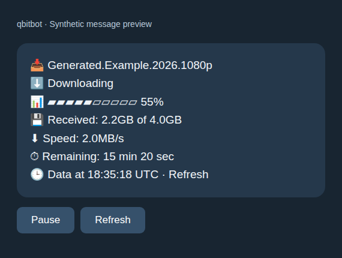
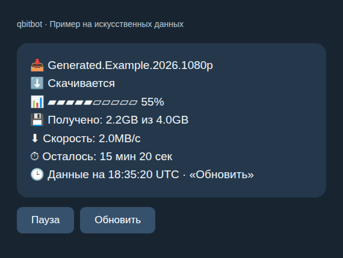

# qbitbot

Search torrents and manage qBittorrent downloads from Telegram, in English or Russian.
Run the bot, qBittorrent and Jackett together with Docker Compose, or connect the bot
to services you already operate.

[English setup](docs/setup.en.md) · [Установка на русском](docs/setup.ru.md)

## What it does

- Search Jackett, choose quality/size filters, compare release details and confirm a download.
- Use compact numbered buttons, progress cards, pause/resume and confirmed deletion.
- Receive completion notifications and keep an hourly service-health card.
- Detect English/Russian from Telegram or save a preference with `/language`.
- Preserve subscriptions, queued notifications, health cards and language choices through restarts.

All allowlisted users administer the entire connected qBittorrent library. Deletion
removes the torrent **and its files**, after confirmation. Jackett indexers require
manual setup; no tracker accounts or credentials are supplied. Direct Telegram file
uploads and media-app integration are outside this release.

## NAS support

**Tested on QNAP with Container Station and Docker Compose (Linux amd64 / x86_64).**
Public v0.3.0 passed live Telegram acceptance on this platform. Run the bundled
stack for a new installation, or use bot-only mode with existing qBittorrent and
Jackett services. See the [English](docs/setup.en.md#nas-installation) or
[Russian](docs/setup.ru.md#установка-на-nas) NAS setup notes.
Other NAS platforms and ARM architectures have not been verified.

## Preview

Synthetic examples rendered from the bot's message formatters; these are not live chats.




## Operations

[Backup/restore](docs/backup.en.md) · [Копирование и восстановление](docs/backup.ru.md)

[Troubleshooting](docs/troubleshooting.en.md) · [Устранение неполадок](docs/troubleshooting.ru.md)

Live Telegram acceptance was confirmed by the operator on 2026-09-27; see the
[acceptance record](docs/acceptance-v0.3.0.md) for scope and remaining limitations.
Automated checks use generated torrents, local APIs and a fake Telegram transport.
No prebuilt registry image is published; Compose builds the bot from reviewed source.

## Development

Use Python 3.12:

```sh
python3.12 -m venv .venv
.venv/bin/python -m pip install -r requirements-dev.lock
make check
make compose-check
make integration
make integration-public
```

Unit tests block networking. Docker checks create and remove only their own isolated
resources. `make integration-public` requires Compose 2.24.4+ and Git history for its
original-public-code rollback rehearsal. See [contributor guidance](AGENTS.md),
[source layout](docs/development/layout.md),
[localization](docs/development/localization.md) and the [release checklist](docs/release-checklist.md).

## License

Original project code is MIT licensed. Dependencies and service images retain their
own licenses; see [third-party notices](THIRD_PARTY_NOTICES.md).
